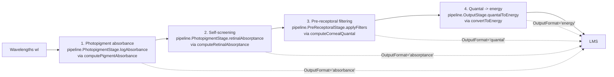
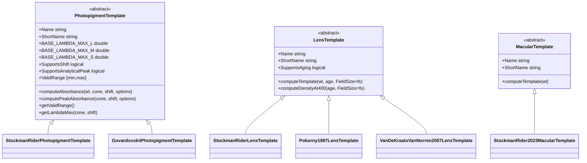

# Architecture

This document describes how the toolbox is organized, how the classes
relate to each other, and where to add new code. For a usage tour see
[`examples/README.md`](examples/README.md); for the public API see
the class docstrings (`help IndividualCMF`, etc.).

## Repository layout

```
individual-cmfs-matlab/
|-- toolbox/                    Core library (the .mltbx-packageable code)
|   |-- IndividualCMF.m         Top-level observer model (public API entry)
|   |-- ObserverParameters.m    Value-object snapshot of observer state
|   |-- PhotopigmentParameters.m
|   |-- PreReceptoralFilter.m
|   |-- Genotype.m              Genotype string parser + shift table
|   |-- PhotopigmentTemplate.m  Abstract base for cone absorbance templates
|   |-- LensTemplate.m          Abstract base for lens density templates
|   |-- StockmanRiderPhotopigmentTemplate.m
|   |-- GovardovskiiPhotopigmentTemplate.m
|   |-- StockmanRiderLensTemplate.m
|   |-- Pokorny1987LensTemplate.m
|   |-- VanDeKraatsVanNorren2007LensTemplate.m
|   |-- MacularTemplate.m       Abstract base for macular density templates
|   |-- StockmanRider2023MacularTemplate.m
|   |-- CIE170.m                CIE 170-1:2006 / 170-2:2015 constants
|   |-- Nomograms.m             Raw absorbance computations (Fourier series, alpha/beta bands)
|   |-- NormalizationCache.m    Per-observer peak cache for fast normalization
|   |-- CMFPlotter.m            Visualization layer used by IndividualCMF plot wrappers
|   |-- +pipeline/              Pure-function compute stages (Photopigment, PreReceptoral, Output)
|   |-- +enums/                 Strategy/algorithm enum types
|   `-- +validators/            Reusable mustBe* validators
|-- examples/                   18 plain-text Live Scripts (curated tutorial path)
|-- tests/                      Unit tests, integration tests, parity tests
|   |-- data/                   CSV reference data
|   `-- parity/                 Pycone parity adapter and configs
|-- buildUtilities/             buildtool helpers (badge generators)
|-- reports/                    CI-generated reports (badges committed, XML ignored)
|-- resources/project/          MATLAB Project metadata
|-- buildfile.m                 buildtool entry point (check, test, clean tasks)
`-- ARCHITECTURE.md             You are here
```

## Layering and dependencies

The toolbox follows a strict leaf-to-root dependency layering. Higher
layers may depend on lower layers; the reverse is forbidden. Adding a
new class means deciding which layer it belongs to and only depending
on the layers below.

```mermaid
graph TD
    subgraph L5["Layer 5 - Top-level public API"]
        IndividualCMF
    end
    subgraph L4["Layer 4 - Observer state"]
        ObserverParameters
        Genotype
    end
    subgraph L3["Layer 3 - Domain primitives"]
        PhotopigmentParameters
        PreReceptoralFilter
    end
    subgraph L2["Layer 2 - Strategy implementations"]
        PhotopigmentTemplate
        LensTemplate
        MacularTemplate
        SR_Photo[StockmanRiderPhotopigmentTemplate]
        Gov_Photo[GovardovskiiPhotopigmentTemplate]
        SR_Lens[StockmanRiderLensTemplate]
        Pok_Lens[Pokorny1987LensTemplate]
        VdK_Lens[VanDeKraatsVanNorren2007LensTemplate]
        SR_Mac[StockmanRider2023MacularTemplate]
    end
    subgraph L1["Layer 1 - Utilities and visualization"]
        Nomograms
        NormalizationCache
        CMFPlotter
    end
    subgraph L0["Layer 0 - Leaf modules: constants and types"]
        CIE170
        Enums[+enums/*]
        Validators[+validators/*]
    end

    IndividualCMF --> ObserverParameters
    IndividualCMF --> Genotype
    IndividualCMF --> CMFPlotter
    IndividualCMF --> NormalizationCache
    IndividualCMF --> PhotopigmentTemplate
    IndividualCMF --> LensTemplate
    IndividualCMF --> MacularTemplate
    IndividualCMF --> Enums
    IndividualCMF --> CIE170
    IndividualCMF --> Validators

    ObserverParameters --> PhotopigmentParameters
    ObserverParameters --> PreReceptoralFilter
    ObserverParameters --> Enums
    ObserverParameters --> CIE170

    Genotype --> CIE170

    PhotopigmentParameters --> CIE170
    PreReceptoralFilter --> CIE170

    SR_Photo --> PhotopigmentTemplate
    Gov_Photo --> PhotopigmentTemplate
    SR_Lens --> LensTemplate
    Pok_Lens --> LensTemplate
    VdK_Lens --> LensTemplate
    SR_Mac --> MacularTemplate
    SR_Lens --> CIE170
    SR_Mac --> CIE170

    Nomograms --> Validators
    CMFPlotter --> IndividualCMF
```



Three constraints hold:

1. **No cycles.** A leaf class (`CIE170`, an enum, a validator) never
   references anything in a higher layer.
2. **Sibling independence.** `PhotopigmentTemplate` does not depend on
   `LensTemplate` or vice versa. The two strategy hierarchies stand
   alone.
3. **Single source of truth for shared values.** `CIE170` and `+enums/*`
   are pure value carriers; every domain class refers to them rather
   than duplicating values or string-typed members.

## The four-stage LMS pipeline

A call to `obs.LMS(wl)` traverses four computation stages. The
dispatcher `computeSensitivityCore` calls `computeRawSensitivity`,
which in turn invokes a dedicated method for each stage and returns
early once the requested `OutputFormat` is reached. The math for each
stage lives in a pure-function class under `toolbox/+pipeline/`; the
`IndividualCMF` methods are thin orchestrators that gather inputs from
observer state and delegate. See [Compute pipeline (`+pipeline/`)](#compute-pipeline-pipeline)
below for the rationale.



Stage details:

| Stage | Pure-function owner | Orchestrator | Key formula |
|---|---|---|---|
| 1a. Absorbance | `pipeline.PhotopigmentStage.logAbsorbance` (delegates to `PhotopigmentTemplate` subclass) | `IndividualCMF.computePigmentAbsorbance` | log10 absorbance shape, positioned at lambda-max |
| 1b/2. Absorptance | `pipeline.PhotopigmentStage.retinalAbsorptance` | `IndividualCMF.computeRetinalAbsorptance` | Relative retinal absorptance `(1 - 10^(-OD * absorbance)) / (1 - 10^(-OD))`. The raw physical fraction `1 - 10^(-OD * absorbance)` is available via `pipeline.PhotopigmentStage.absorptanceFromAbsorbance(..., Normalize=false)`. |
| 3. Pre-receptoral filtering | `pipeline.PreReceptoralStage.applyFilters` | `IndividualCMF.computeCornealQuantal` | `* 10^(-lens density - macular density)` |
| 4. Energy conversion | `pipeline.OutputStage.quantalToEnergy` | `IndividualCMF.convertToEnergy` | `* lambda` (S&R 2023 Eq. 8) |
| post: Normalize / log / NaN | `pipeline.OutputStage.{normalize, applyLog, cleanNaN}` | `IndividualCMF.computeSensitivityCore` | divide by cached peak; log10 with NaN/Inf -> -10 |

When `NormalizeOutput=true` (the default), the returned spectrum is
divided by its peak. For `absorptance`, `quantal`, and `energy` the
peak is supplied by `NormalizationCache` (per-cone, per-format).
The `absorbance` format bypasses the cache: the raw template output
is returned directly because it is already shape-normalized at
`lambda-max`.

The optional `LogOutput=true` post-processes the final output through
`log10(...)`. This is independent of `OutputFormat` and is applied last.

For one-off queries in a different mode without mutating the observer,
`obs.LMS(wl, OutputFormat=..., LogOutput=..., NormalizeOutput=...)`
takes overrides as Name=Value arguments. The persistent observer state
is unchanged.

## Derived quantities

Everything past the LMS pipeline is a linear transform on the
energy-normalized LMS spectrum. These methods live on `IndividualCMF`
and always evaluate at `OutputFormat="energy"` regardless of the
observer's persistent format, so they reflect the convention of
published CIE tables:

| Method | Returns | Definition |
|---|---|---|
| `XYZ(wl)` | Nx3 CIE XYZ CMFs | LMS->XYZ matrix from `CIE170` (2-deg under 4 deg FieldSize, otherwise 10-deg). |
| `RGB(wl)` | Nx3 RGB CMFs | Solve `Primaries * w = LMS` per wavelength, normalize so the primaries sum to white. |
| `Luminance(wl)` | Nx1 V*(lambda) | y-bar row of the active LMS->XYZ matrix (`a L + b M`). |
| `lmChromaticity(wl)` | Nx2 (l, m) | LMS divided by L+M+S sum. |
| `xyChromaticity(wl)` | Nx2 (x, y) | XYZ divided by X+Y+Z sum. |
| `MacLeodBoynton(wl)` | Nx2 (l_MB, s_MB) | L/(L+M), S/(L+M). |

`evaluate(wl, Data=..., Format=...)` is the entry point that returns
any of these in `"array"`, `"table"`, or `"struct"` form; the `"table"`
form is paired with `writetable` for CSV / Excel export.

The pre-receptoral filter spectra used internally by stage 3 are also
exposed directly:

| Method | Returns | Definition |
|---|---|---|
| `getLensDensitySpectrum(wl)` | Nx1 | Lens optical density at each wavelength (the active `LensTemplate` evaluated for the observer's `Age` and `FieldSize`). |
| `getMacularDensitySpectrum(wl)` | Nx1 | Macular optical density at each wavelength (`MacularTemplate` rescaled so the peak equals `obs.MacularDensity`). |

## Multi-observer construction

`IndividualCMF.across(parameter, values, fixedArgs)` is a static factory
that returns a 1xN array of observers varying one constructor argument
across the supplied `values`. The remaining arguments are passed verbatim
to each constructor call:

```matlab
observers = IndividualCMF.across('Age', [25 50 75], ...
    LensModel="VanDeKraats2007", FieldSize=10);
densities = [observers.LensDensity];
```

`parameter` accepts any constructor argument including the
constructor-only `Genotype`; `fixedArgs` uses the `?IndividualCMF` repeating-arguments
pattern so any name-value combination valid at the constructor is valid
here.

## Key design patterns

### Strategy via abstract templates

The toolbox has three plug-in points for spectral models, each
expressed as an abstract base class with concrete subclasses for
different published models. The choice is exposed to the user as an
enum (`enums.PhotopigmentModel` for photopigment, `enums.LensModel` for
lens, `enums.MacularModel` for macular pigment); `IndividualCMF` swaps
the strategy object on property change.



The class-level invariants (`BASE_LAMBDA_MAX_*`, `Supports*`) are
declared as abstract Constant properties, so the base class can dispatch
without `isa()` checks.

`LensTemplate` and `MacularTemplate` both follow a unit-peak
normalization convention -- `computeTemplate` returns a spectrum
normalized to 1.0 at the model's reference wavelength (400 nm for
lens, 460 nm for macular). The observer's `LensDensity` and
`MacularDensity` properties are the absolute peak ODs at those
wavelengths, so multiplying them by the template gives the absolute
density spectrum directly. `MacularTemplate` is currently a one-member
hierarchy (the Stockman & Rider 2023 / CIE 170-1:2006 shape); the
abstract base exists so additional macular shapes can be plugged in
without changing `IndividualCMF`'s public surface.

### Compute pipeline (`+pipeline/`)

The LMS compute pipeline is decomposed into three pure-function stages,
each implemented as a static-only class in `toolbox/+pipeline/`:

| Stage class | Public static methods | Inputs | Output |
|---|---|---|---|
| `pipeline.PhotopigmentStage` | `logAbsorbance`, `retinalAbsorptance` | template, wavelengths, cone type, lambda-max shift, optical density, normalisation flag (`true` for relative retinal absorptance, `false` for raw `1-10^(-OD*A)`) | log absorbance, then retinal absorptance |
| `pipeline.PreReceptoralStage` | `applyFilters` | absorptance, wavelengths, lens template + density, macular template + density, age | corneal quantal sensitivity |
| `pipeline.OutputStage` | `quantalToEnergy`, `normalize`, `applyLog`, `cleanNaN` | quantal, peak, log/clean flags | energy units, normalized, log-transformed, NaN-cleaned |

Each stage takes pure data as inputs (templates, primitive arrays,
scalars) and returns pure outputs. Stages do not hold state, do not
reference `IndividualCMF`, and have their own dedicated test files
(`PhotopigmentStageTest.m`, `PreReceptoralStageTest.m`,
`OutputStageTest.m`) that exercise each helper in isolation.

`IndividualCMF` orchestrates the pipeline: its `computePigmentAbsorbance`
/ `computeRetinalAbsorptance` / `computeCornealQuantal` /
`convertToEnergy` methods read state from observer fields, pass the
resolved values to the corresponding stage method, and return the
result. The `computeSensitivityCore` dispatcher then composes the
stage outputs into the final response.

This split exists because the math at each stage is fully determined by
its inputs -- the previous mixing of math and observer-state access made
the stages hard to test independently and obscured the data flow. With
the split, the file structure mirrors the pipeline diagram above, and a
new `PhotopigmentTemplate` (or new lens template, etc.) can be tested
against the stage directly without instantiating `IndividualCMF`.

### Parameter Object: ObserverParameters

`ObserverParameters` is a MATLAB value class (no `< handle`) that
captures the full configuration of an observer: physiological values,
model selections, and algorithm modes. Because it is a value class,
assigning a property produces a copy rather than mutating shared state,
so a captured snapshot is decoupled from the live observer.
`getParameters()` returns such a snapshot; `setParameters(params)`
applies one. The round-trip preserves observer state exactly:
`obs2.setParameters(obs1.getParameters())` reproduces `obs1`'s LMS
output bit-for-bit.

### Formula vs Custom algorithm modes

Three derived physiological quantities have an `*Algorithm` companion
enum that selects how they are computed:

| Quantity | Algorithm enum | Formula values | Custom value |
|---|---|---|---|
| Lens density | `enums.LensDensityAlgorithm` | `Auto` (delegates to active `LensTemplate`) | `Custom` |
| Macular density | `enums.MacularDensityAlgorithm` | `CIE170`, `MorelandAlexander` | `Custom` |
| Photopigment optical densities | `enums.PhotopigmentDensityAlgorithm` | `CIE170`, `PokornySmith` | `Custom` |

Each quantity defaults to a formula mode and recomputes when its inputs
(age, field size, template) change. Assigning the dependent property
directly auto-engages `Custom` and pins the value:

```matlab
obs.LensDensity = 1.85;            % auto-engages LensDensityAlgorithm="Custom"
obs.Age = 70;                      % does NOT recompute LensDensity (still Custom)
obs.LensDensityAlgorithm = "Auto"; % switches back; recomputes from age via the lens template
```

The pattern protects user intent from being clobbered by subsequent
property changes. Modes are enum-typed, so string assignments like
`"Auto"` and `"Custom"` are validated at assignment.

### NormalizationCache

Peak normalization requires finding the maximum of a sensitivity curve
in continuous wavelength space (not just at the input grid points).
The cache stores the peak per (cone, format) pair and invalidates when
relevant observer state changes, via `addlistener` hooks on
`OutputFormat`, `LogOutput`, `NormalizeOutput`, and the upstream
parameters that affect the spectrum. Cache misses are filled by
analytical peaks (for templates with `SupportsAnalyticalPeak=true`,
i.e. Govardovskii absorptance) or numerical search (`fminbnd` /
`Sampled` grid). Configurable via
`NormalizationMethod = "Continuous" | "Sampled"`. Note that the
`absorbance` format does not flow through the cache: the template is
already shape-normalized to 1 at lambda-max.

### CIE170 as leaf-level constants

`CIE170.m` holds the canonical numerical values from CIE 170-1:2006 and
CIE 170-2:2015. It has no methods, no dependencies, and sits below every
domain class in the dependency graph. Domain classes reference
`CIE170.STD_AGE`, `CIE170.M_2DEG`, etc. directly rather than redeclaring
the same numbers.

Provenance-specific constants (Stockman & Rider 2023 genotype scaling,
Pokorny 1987 lens-aging coefficients, Pokorny & Smith 1976 OD formula,
Moreland & Alexander 1997 macular formula) live in their owning domain
class because each set is consumed by exactly one or two callers.

### LMS query overrides

`IndividualCMF.LMS(wl, OutputFormat=..., LogOutput=..., NormalizeOutput=...)`
accepts the three persistent flags as per-call Name=Value overrides
that don't mutate the observer. Implementation routes directly to
`computeSensitivityCore(...)` with the resolved arguments, bypassing
the L/M/S getters that read persistent state. This was added to remove
the capture/restore dance from `CMFPlotter`'s plot methods.

## Extension points

### Add a new photopigment template

1. Create `toolbox/MyModelPhotopigmentTemplate.m` that subclasses
   `PhotopigmentTemplate`. Implement `computeAbsorbance` and
   `computePeakAbsorbance`, and declare the abstract Constant
   properties (`BASE_LAMBDA_MAX_L/M/S`, `SupportsShift`,
   `SupportsAnalyticalPeak`, `ValidRange`). The base class provides
   `getValidRange()` and `getLambdaMax()` automatically.
2. Add the enum value to `toolbox/+enums/PhotopigmentModel.m`.
3. In `IndividualCMF.set.PhotopigmentModel`, add a branch that instantiates
   your subclass when the new enum value is selected.
4. Add tests under `tests/`.

### Add a new lens template

Same pattern as above with `LensTemplate`, `enums.LensModel`, and
`IndividualCMF.set.LensModel`. `LensTemplate.computeTemplate(wl, age)`
returns the OD spectrum normalized to 1.0 at 400 nm; `computeDensityAt400(age)`
returns the absolute peak. Both methods accept an optional Name-Value
`FieldSize` argument for templates whose density depends on observer
field size (e.g. the small-field vs large-field Rayleigh-loss
coefficient in vK&vN 2007); templates that don't model field size
simply ignore it. See `VanDeKraatsVanNorren2007LensTemplate` for an
age- and field-size-dependent multi-component example.

### Add a new macular template

1. Create `toolbox/MyModelMacularTemplate.m` subclassing
   `MacularTemplate`. Implement `computeTemplate(wl)` returning the OD
   spectrum normalized to 1.0 at 460 nm; set `Name` and `ShortName`.
2. Add the enum value to `toolbox/+enums/MacularModel.m`.
3. In `IndividualCMF.set.MacularModel`, add a branch that instantiates
   your subclass.
4. Add tests; update the parity harness if the new template diverges
   from the pycone macular shape (the current parity rig assumes the
   S&R 2023 macular template, just as it assumes the S&R 2023 lens
   template).

### Add a new algorithm mode

Algorithm modes (e.g., `MacularDensityAlgorithm`) are enums under
`+enums/`. To add a new mode:

1. Add the enum value to the relevant `+enums/*Algorithm.m`.
2. In `IndividualCMF.update<Quantity>` (e.g., `updateMacularDensity`),
   add a branch that handles the new mode.
3. Add tests covering switch-into and switch-out-of behavior.

### Add a published constant

If the constant is from a CIE publication and used across multiple
domains, add it to `CIE170.m`. Otherwise add it to its owning domain
class (e.g., a Pokorny 1987 coefficient goes on `Pokorny1987LensTemplate`).

### Add a new plot method

Add a method to `CMFPlotter.m` returning `[p, ax]` consistent with the
other plot methods. If the method should be discoverable from
`IndividualCMF`, add a thin `varargout`-forwarding wrapper alongside the
other plot wrappers in `IndividualCMF.m` (`plotLMS`, `plotXYZ`,
`plotRGBCMFs`, `plotChromaticity`, `plotAbsorbance`, `plotAbsorptance`,
`plotQuantalEnergy`, `plotLens`, `plotMacular`, `plotDiagnostics`,
`compareTo`). All wrappers reset axis state (`XLimMode`, `YLimMode`,
`DataAspectRatioMode`, `PlotBoxAspectRatioMode`) after `cla(ax)` so a
prior section's `axis equal` / explicit limits don't leak in; follow
that pattern.

### Verify pycone parity after a change

`tests/parity/` runs the toolbox against the reference Python
implementation across 28 configurations and 5 output formats. Any
change to the LMS pipeline should leave parity at machine precision
(`assertEqual` with `AbsTol=1e-12`). See `tests/parity/README.md` for
the comparison protocol.

## File-naming conventions

- Public class files: PascalCase, file name = class name (e.g.,
  `ObserverParameters.m`).
- Concrete templates: `<Source><Domain>Template.m` where `<Source>` is
  the publication identifier and `<Domain>` is `Photopigment` or
  `Lens` (e.g., `StockmanRiderPhotopigmentTemplate.m`,
  `Pokorny1987LensTemplate.m`).
- Tests: `<ClassName>Test.m`.
- Examples: `Example<NN>_<TitleCase>.m` where `<NN>` is a 2-digit sequence number (e.g., `Example05_GeneticVariants.m`).

## Public vs internal

`IndividualCMF` is the user-facing entry point. Most users will not
need to touch the strategy subclasses or the parameter object directly.
The internal toolbox structure (`Nomograms`, `NormalizationCache`,
`computeSensitivityCore`, etc.) is documented but not part of the
stable API; internals may evolve faster than the top-level
`IndividualCMF` interface.

## See also

- [`README.md`](README.md) - install and quickstart
- [`examples/README.md`](examples/README.md) - the curated learning
  path through the 18 example scripts
- [`tests/parity/README.md`](tests/parity/README.md) - pycone parity
  protocol
- [`CITATION.cff`](CITATION.cff) - how to cite the toolbox
