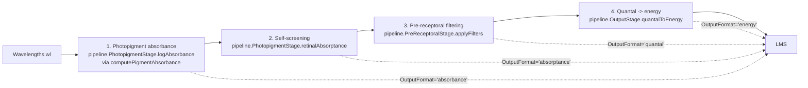
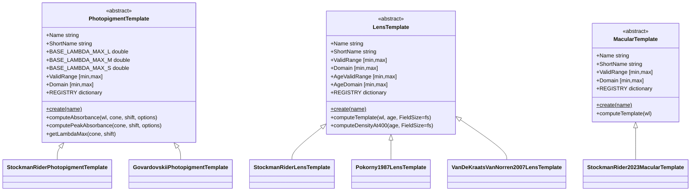

# Architecture

This document describes how the toolbox is organized, how the classes
relate to each other, and where to add new code. For a usage tour see
[`toolbox/examples/README.md`](toolbox/examples/README.md); for the public API see
the class docstrings (`help IndividualCMF`, etc.).

## Repository layout

```
individual-cmfs-matlab/
|-- toolbox/                    Core library (the .mltbx-packageable code)
|   |-- IndividualCMF.m         Top-level observer model (public API entry)
|   |-- ObserverParameters.m    Value-object snapshot of observer state
|   |-- PhotopigmentParameters.m
|   |-- PreReceptoralFilter.m
|   |-- Genotype.m              Genotype string parser + shift table
|   |-- PhotopigmentTemplate.m  Abstract base for cone absorbance templates
|   |-- LensTemplate.m          Abstract base for lens density templates
|   |-- StockmanRiderPhotopigmentTemplate.m
|   |-- GovardovskiiPhotopigmentTemplate.m
|   |-- StockmanRiderLensTemplate.m
|   |-- Pokorny1987LensTemplate.m
|   |-- VanDeKraatsVanNorren2007LensTemplate.m
|   |-- MacularTemplate.m       Abstract base for macular density templates
|   |-- StockmanRider2023MacularTemplate.m
|   |-- CIE170.m                CIE 170-1:2006 / 170-2:2015 constants
|   |-- Nomograms.m             Raw absorbance computations (Fourier series, alpha/beta bands)
|   |-- NormalizationCache.m    Per-observer peak cache for fast normalization
|   |-- +pipeline/              Pure-function compute stages (Photopigment, PreReceptoral, Output)
|   |-- +enums/                 Strategy/algorithm enum types
|   |-- +validators/            Reusable mustBe* validators
|   |-- doc/                    GettingStarted.m (registered Getting Started guide)
|   `-- examples/               18 plain-text Live Scripts (curated tutorial path) + utils/
|-- tests/                      Unit tests, integration tests, parity tests
|   |-- data/                   CSV reference data
|   `-- parity/                 Pycone parity adapter and configs
|-- buildUtilities/             buildtool helpers (badge generators)
|-- reports/                    CI-generated reports (badges committed, XML ignored)
|-- resources/project/          MATLAB Project metadata
|-- buildfile.m                 buildtool entry point (check, test, clean tasks)
`-- ARCHITECTURE.md             You are here
```

## Layering and dependencies

The toolbox follows a strict leaf-to-root dependency layering. Higher
layers may depend on lower layers; the reverse is forbidden. Adding a
new class means deciding which layer it belongs to and only depending
on the layers below.


```mermaid
graph TD
    subgraph L5["Layer 5 - Top-level public API"]
        IndividualCMF
    end
    subgraph L4["Layer 4 - Observer state"]
        ObserverParameters
        Genotype
    end
    subgraph L3["Layer 3 - Domain primitives"]
        PhotopigmentParameters
        PreReceptoralFilter
    end
    subgraph L2["Layer 2 - Strategy implementations"]
        PhotopigmentTemplate
        LensTemplate
        MacularTemplate
        SR_Photo[StockmanRiderPhotopigmentTemplate]
        Gov_Photo[GovardovskiiPhotopigmentTemplate]
        SR_Lens[StockmanRiderLensTemplate]
        Pok_Lens[Pokorny1987LensTemplate]
        VdK_Lens[VanDeKraatsVanNorren2007LensTemplate]
        SR_Mac[StockmanRider2023MacularTemplate]
    end
    subgraph L1["Layer 1 - Utilities"]
        Nomograms
        NormalizationCache
    end
    subgraph L0["Layer 0 - Leaf modules: constants and types"]
        CIE170
        Enums[+enums/*]
        Validators[+validators/*]
    end

    IndividualCMF --> ObserverParameters
    IndividualCMF --> Genotype
    IndividualCMF --> NormalizationCache
    IndividualCMF --> PhotopigmentTemplate
    IndividualCMF --> LensTemplate
    IndividualCMF --> MacularTemplate
    IndividualCMF --> Enums
    IndividualCMF --> CIE170
    IndividualCMF --> Validators

    ObserverParameters --> PhotopigmentParameters
    ObserverParameters --> PreReceptoralFilter
    ObserverParameters --> Enums
    ObserverParameters --> CIE170

    Genotype --> CIE170

    PhotopigmentParameters --> CIE170
    PreReceptoralFilter --> CIE170

    SR_Photo --> PhotopigmentTemplate
    Gov_Photo --> PhotopigmentTemplate
    SR_Lens --> LensTemplate
    Pok_Lens --> LensTemplate
    VdK_Lens --> LensTemplate
    SR_Mac --> MacularTemplate
    SR_Lens --> CIE170
    SR_Mac --> CIE170

    Nomograms --> Validators
```

Three constraints hold:

1. **No cycles.** A leaf class (`CIE170`, an enum, a validator) never
   references anything in a higher layer.
2. **Sibling independence.** `PhotopigmentTemplate` does not depend on
   `LensTemplate` or vice versa. The two strategy hierarchies stand
   alone.
3. **Single source of truth for shared values.** `CIE170` and `+enums/*`
   are pure value carriers; every domain class refers to them rather
   than duplicating values or string-typed members.

## The four-stage LMS pipeline

A call to `obs.LMS(wl)` traverses four computation stages. The
dispatcher `computeSensitivityCore` calls `computeRawSensitivity`,
which walks the stages in order and returns early once the requested
`OutputFormat` is reached. The math for each stage lives in a
pure-function class under `toolbox/+pipeline/`, called directly.
Only stage 1 keeps an `IndividualCMF` method of its own
(`computePigmentAbsorbance`), because resolving the template, the
lambda-max shifts and the genotype takes more observer state than the
other three combined. See [Compute pipeline (`+pipeline/`)](#compute-pipeline-pipeline)
below for the rationale.


```mermaid
flowchart LR
    Input[Wavelengths wl] --> S1
    S1[1. Photopigment absorbance<br/>pipeline.PhotopigmentStage.logAbsorbance<br/>via computePigmentAbsorbance]
    S2[2. Self-screening<br/>pipeline.PhotopigmentStage.retinalAbsorptance]
    S3[3. Pre-receptoral filtering<br/>pipeline.PreReceptoralStage.applyFilters]
    S4[4. Quantal -> energy<br/>pipeline.OutputStage.quantalToEnergy]
    S1 --> S2 --> S3 --> S4 --> Out
    S1 -.->|"OutputFormat='absorbance'"| Out[LMS]
    S2 -.->|"OutputFormat='absorptance'"| Out
    S3 -.->|"OutputFormat='quantal'"| Out
    S4 -.->|"OutputFormat='energy'"| Out
```

Every one of those four exits passes through `applyDomainFloor` before
returning, so a wavelength outside the observer's `Domain` reads zero
whichever format the caller asked for. The floor lives in
`computeRawSensitivity` rather than in its callers because there are
four of those -- `computeSensitivityCore`, `RGB`, the sampled peak in
`NormalizationCache`, and the `fminbnd` peak objective -- and guarding
only the first left the other three returning values as large as
4.2e+153.

Stage details:

| Stage | Pure-function owner | Called from | Key formula |
|---|---|---|---|
| 1a. Absorbance | `pipeline.PhotopigmentStage.logAbsorbance` (delegates to `PhotopigmentTemplate` subclass) | `IndividualCMF.computePigmentAbsorbance` | log10 absorbance shape, positioned at lambda-max |
| 1b/2. Absorptance | `pipeline.PhotopigmentStage.retinalAbsorptance` | `computeRawSensitivity` | Relative retinal absorptance `(1 - 10^(-OD * absorbance)) / (1 - 10^(-OD))`. The raw physical fraction `1 - 10^(-OD * absorbance)` is available via `pipeline.PhotopigmentStage.absorptanceFromAbsorbance(..., Normalize=false)`. |
| 3. Pre-receptoral filtering | `pipeline.PreReceptoralStage.applyFilters` | `computeRawSensitivity` | `* 10^(-lens density - macular density)` |
| 4. Energy conversion | `pipeline.OutputStage.quantalToEnergy` | `computeRawSensitivity` | `* lambda` (S&R 2023 Eq. 8) |
| post: Normalize / log / NaN | `pipeline.OutputStage.{normalize, applyLog, cleanNaN}` | `IndividualCMF.computeSensitivityCore` | divide by cached peak; log10 with NaN/Inf -> -10 |

When `NormalizeOutput=true` (the default), the returned spectrum is
divided by its peak. Three of the four formats are normalized --
`absorptance`, `quantal`, and `energy` -- with the peak supplied by
`NormalizationCache` (per-cone, per-format).

`absorbance` is never normalized, whatever `NormalizeOutput` says. Its
absolute scale is load-bearing: the templates are defined with
`A(lambda-max) = 1` by convention -- the Fourier fit actually peaks at
0.9949 for L -- which is what makes the `Lod` / `Mod` / `Sod`
parameters mean peak *axial* optical density. Divide the spectrum by
anything and those three stop meaning what the literature says they
mean. `getPeak(cone, OutputFormat="absorbance")` still reports a
number, but it is diagnostic and never applied as a divisor -- it is
how you read the template's true maximum, which is not 1 and does not
sit exactly at lambda-max (0.9949448501 for the Stockman-Rider L cone,
1.0349751181 for the Govardovskii A2 S cone, where the beta band pushes
the maximum off the alpha peak). This matches pycone, which normalizes
the same three stages and leaves absorbance alone.

The optional `LogOutput=true` post-processes the final output through
`log10(...)`. This is independent of `OutputFormat` and is applied last.

For one-off queries in a different mode without mutating the observer,
`obs.LMS(wl, OutputFormat=..., LogOutput=..., NormalizeOutput=...)`
takes overrides as Name=Value arguments. The persistent observer state
is unchanged.

## Derived quantities

Everything past the LMS pipeline is a linear transform on the
energy-normalized LMS spectrum. These methods live on `IndividualCMF`
and always evaluate at `OutputFormat="energy"` regardless of the
observer's persistent format, so they reflect the convention of
published CIE tables:

| Method | Returns | Definition |
|---|---|---|
| `XYZ(wl)` | Nx3 CIE XYZ CMFs | LMS->XYZ matrix from `CIE170` (2-deg under 4 deg FieldSize, otherwise 10-deg). |
| `RGB(wl)` | Nx3 RGB CMFs | Solve `Primaries * w = LMS` per wavelength on peak-normalized energy fundamentals. Each cone is divided by its own peak before the solve, so the CMFs come out as the identity at the three primary wavelengths. |
| `Luminance(wl)` | Nx1 V*(lambda) | y-bar row of the active LMS->XYZ matrix (`a L + b M`). |
| `lmChromaticity(wl)` | Nx2 (l, m) | LMS divided by L+M+S sum. |
| `xyChromaticity(wl)` | Nx2 (x, y) | XYZ divided by X+Y+Z sum. |
| `MacLeodBoynton(wl)` | Nx2 (l_MB, s_MB) | `aL/(aL+bM)`, `S/(aL+bM)`, with `(a, b)` the V* luminance weights -- the denominator is luminance, not the unweighted L+M sum. |

`evaluate(wl, Data=...)` returns any of these as a table -- a
`Wavelength_nm` column followed by one column per channel -- ready for
`writetable` CSV / Excel export. Each branch delegates to the method
named by `Data`, so the two never diverge. Call the method directly when
you want the bare numeric array.

The pre-receptoral filter spectra used internally by stage 3 are also
exposed directly:

| Method | Returns | Definition |
|---|---|---|
| `getLensDensitySpectrum(wl)` | Nx1 | Lens optical density at each wavelength (the active `LensTemplate` evaluated for the observer's `Age` and `FieldSize`). |
| `getMacularDensitySpectrum(wl)` | Nx1 | Macular optical density at each wavelength (`MacularTemplate` rescaled so the peak equals `obs.MacularDensity`). |

## Multi-observer construction

`IndividualCMF.across(parameter, values, fixedArgs)` is a static factory
that returns a 1xN array of observers varying one constructor argument
across the supplied `values`. The remaining arguments are passed verbatim
to each constructor call:

```matlab
observers = IndividualCMF.across('Age', [25 50 75], ...
    LensModel="VanDeKraats2007", FieldSize=10);
densities = [observers.LensDensity];
```

`parameter` accepts any constructor argument including the
constructor-only `Genotype`; `fixedArgs` uses the `?IndividualCMF` repeating-arguments
pattern so any name-value combination valid at the constructor is valid
here.

## Key design patterns

### Strategy via abstract templates

The toolbox has three plug-in points for spectral models, each
expressed as an abstract base class with concrete subclasses for
different published models. The choice is exposed to the user as an
enum (`enums.PhotopigmentModel` for photopigment, `enums.LensModel` for
lens, `enums.MacularModel` for macular pigment); `IndividualCMF` swaps
the strategy object on property change.

Each base class owns a `REGISTRY` mapping enum member names to
zero-argument constructor thunks, and a `create(name)` that resolves
through it. Adding a model means adding a subclass, an enum member and
one registry line -- `IndividualCMF` has no dispatch to edit. Thunks
rather than bare class handles, because `Govardovskii2000` and
`Govardovskii2000A2` share a class and differ only in a constructor
argument.


```mermaid
classDiagram
    class PhotopigmentTemplate {
        <<abstract>>
        +Name string
        +ShortName string
        +BASE_LAMBDA_MAX_L double
        +BASE_LAMBDA_MAX_M double
        +BASE_LAMBDA_MAX_S double
        +ValidRange [min,max]
        +Domain [min,max]
        +REGISTRY dictionary
        +create(name)$
        +computeAbsorbance(wl, cone, shift, options)
        +computePeakAbsorbance(cone, shift, options)
        +getLambdaMax(cone, shift)
    }
    class StockmanRiderPhotopigmentTemplate
    class GovardovskiiPhotopigmentTemplate
    class LensTemplate {
        <<abstract>>
        +Name string
        +ShortName string
        +ValidRange [min,max]
        +Domain [min,max]
        +AgeValidRange [min,max]
        +AgeDomain [min,max]
        +REGISTRY dictionary
        +create(name)$
        +computeTemplate(wl, age, FieldSize=fs)
        +computeDensityAt400(age, FieldSize=fs)
    }
    class StockmanRiderLensTemplate
    class Pokorny1987LensTemplate
    class VanDeKraatsVanNorren2007LensTemplate
    class MacularTemplate {
        <<abstract>>
        +Name string
        +ShortName string
        +ValidRange [min,max]
        +Domain [min,max]
        +REGISTRY dictionary
        +create(name)$
        +computeTemplate(wl)
    }
    class StockmanRider2023MacularTemplate

    PhotopigmentTemplate <|-- StockmanRiderPhotopigmentTemplate
    PhotopigmentTemplate <|-- GovardovskiiPhotopigmentTemplate
    LensTemplate <|-- StockmanRiderLensTemplate
    LensTemplate <|-- Pokorny1987LensTemplate
    LensTemplate <|-- VanDeKraatsVanNorren2007LensTemplate
    MacularTemplate <|-- StockmanRider2023MacularTemplate
```

The class-level invariants (`BASE_LAMBDA_MAX_*`, `ValidRange`,
`Domain`) are declared as abstract Constant properties, so the base
class can dispatch without `isa()` checks.

`ValidRange` and `Domain` are deliberately two properties, not one.
`ValidRange` is where the source publication has a basis; `Domain` is
where the implementation has any answer at all. Between them the value
is kept and warned about once, so a smooth decay past the end of a fit
survives intact. Outside `Domain` there is no value: sensitivities read
0 and density spectra read NaN. The Stockman-Rider Fourier templates
are why the second bound has to exist -- they are fitted over half a
period and diverge rather than decay outside it.

`LensTemplate` and `MacularTemplate` both follow a unit-peak
normalization convention -- `computeTemplate` returns a spectrum
normalized to 1.0 at the model's reference wavelength (400 nm for
lens, 460 nm for macular). The observer's `LensDensity` and
`MacularDensity` properties are the absolute peak ODs at those
wavelengths, so multiplying them by the template gives the absolute
density spectrum directly. `MacularTemplate` is currently a one-member
hierarchy (the Stockman & Rider 2023 / CIE 170-1:2006 shape); the
abstract base exists so additional macular shapes can be plugged in
without changing `IndividualCMF`'s public surface.

### Compute pipeline (`+pipeline/`)

The LMS compute pipeline is decomposed into three pure-function stages,
each implemented as a static-only class in `toolbox/+pipeline/`:

| Stage class | Public static methods | Inputs | Output |
|---|---|---|---|
| `pipeline.PhotopigmentStage` | `logAbsorbance`, `retinalAbsorptance` | template, wavelengths, cone type, lambda-max shift, optical density, normalisation flag (`true` for relative retinal absorptance, `false` for raw `1-10^(-OD*A)`) | log absorbance, then retinal absorptance |
| `pipeline.PreReceptoralStage` | `applyFilters` | absorptance, wavelengths, lens template + density, macular template + density, age | corneal quantal sensitivity |
| `pipeline.OutputStage` | `quantalToEnergy`, `normalize`, `applyLog`, `cleanNaN` | quantal, peak, log/clean flags | energy units, normalized, log-transformed, NaN-cleaned |

Each stage takes pure data as inputs (templates, primitive arrays,
scalars) and returns pure outputs. Stages do not hold state, do not
reference `IndividualCMF`, and have their own dedicated test files
(`PhotopigmentStageTest.m`, `PreReceptoralStageTest.m`,
`OutputStageTest.m`) that exercise each helper in isolation.

`IndividualCMF` orchestrates the pipeline from `computeRawSensitivity`,
which gathers the state each stage needs and calls the stage methods
in turn. Only stage 1 keeps a method of its own,
`computePigmentAbsorbance`, because resolving the template, the
lambda-max shifts and the genotype takes more observer state than the
other three stages combined. Stages 2-4 are called directly: the
wrappers they used to have took one argument from observer state and
forwarded the rest unchanged, so they added a name without adding a
decision. The `computeSensitivityCore` dispatcher composes the stage
outputs into the final response.

This split exists because the math at each stage is fully determined by
its inputs -- the previous mixing of math and observer-state access made
the stages hard to test independently and obscured the data flow. With
the split, the file structure mirrors the pipeline diagram above, and a
new `PhotopigmentTemplate` (or new lens template, etc.) can be tested
against the stage directly without instantiating `IndividualCMF`.

### Parameter Object: ObserverParameters

`ObserverParameters` is a MATLAB value class (no `< handle`) that
captures the full configuration of an observer: physiological values,
model selections, and algorithm modes. Because it is a value class,
assigning a property produces a copy rather than mutating shared state,
so a captured snapshot is decoupled from the live observer.
`getParameters()` returns such a snapshot; `setParameters(params)`
applies one.

The round-trip carries **who the observer is**, and
`ObserverParametersRoundTripTest` sweeps every settable public property
to keep that precise:

| Category | Round-trips | Properties |
|---|---|---|
| Physiology, model selections, algorithm modes | exactly (delta 0) | `Age`, `FieldSize`, `LensModel`, `PhotopigmentModel`, `L`/`M_OpsinTemplate`, the three lambda-max shifts, `Lod`/`Mod`/`Sod`, `MacularDensity`, `MacularDensityAlgorithm`, `PhotopigmentDensityAlgorithm` |
| Lens density | to ~1e-12 relative | `LensDensity` |
| Output-shape settings | **not carried, by design** | `OutputFormat`, `LogOutput`, `NormalizeOutput`, `Primaries`, `NormalizationMethod`, `ModelRangeWarning` |

`LensDensity` is stored in the snapshot as a ratio to
`CIE170.STD_LENS_DENSITY_400` -- which is what lets
`isStandardConfiguration` test it against exactly 1.0 -- so the
round-trip divides and multiplies by that constant and `x/c*c` does not
return `x` bit-for-bit. The residual is ~1e-12 relative, and the
standard-observer ratio of 1.0 is lossless.

Output-shape settings are excluded deliberately: a snapshot describes an
observer, not the mode you happen to be viewing them in, so transferring
physiology from a log-mode observer must not flip the receiver's display
mode. `IndividualCMF.snapToStandardObserver` names the same group and
preserves it across a physiology reset, so this is one decision applied
consistently.

### Formula vs Custom algorithm modes

Three derived physiological quantities have an `*Algorithm` companion
enum that selects how they are computed:

| Quantity | Algorithm enum | Assignable formula values | Read-only state |
|---|---|---|---|
| Lens density | `enums.LensDensityAlgorithm` | `Auto` (delegates to active `LensTemplate`) | `Custom` |
| Macular density | `enums.MacularDensityAlgorithm` | `CIE170`, `MorelandAlexander` | `Custom` |
| Photopigment optical densities | `enums.PhotopigmentDensityAlgorithm` | `CIE170`, `PokornySmith` | `Custom` |

Each quantity defaults to a formula mode and recomputes when its inputs
(age, field size, template) change. Pinning a value engages `Custom`;
assigning `[]` is the inverse and hands the quantity back to the formula:

```matlab
obs.LensDensity = 1.85;   % pins it; LensDensityAlgorithm now READS "Custom"
obs.Age = 70;             % does NOT recompute LensDensity (still Custom)
obs.LensDensity = [];     % back to the formula, recomputed from the current Age
```

`Custom` is a state you observe, not a mode you select: assigning it to an
`*Algorithm` property, or naming it in the constructor, raises
`IndividualCMF:CustomIsNotAssignable`. There is no pinned value to claim
unless you supplied one. The formula values stay assignable, because
choosing *which* formula is a genuine choice.

Clearing a cone density reverts the whole group. `Lod`, `Mod` and `Sod`
are produced together by one formula, so `obs.Lod = []` restores all
three.

To freeze whatever the model computed, read the value and assign it back:

```matlab
obs.LensDensity = obs.LensDensity;   % pin the model's own value
```

### NormalizationCache

Peak normalization requires finding the maximum of a sensitivity curve
in continuous wavelength space (not just at the input grid points).
The cache stores the peak per (cone, format) pair and invalidates when
relevant observer state changes, via `addlistener` hooks on
`OutputFormat`, `LogOutput`, `NormalizeOutput`, and the upstream
parameters that affect the spectrum. Cache misses are filled by
numerical search -- `fminbnd` in `Continuous` mode, a grid maximum in
`Sampled` -- selected by
`NormalizationMethod = "Continuous" | "Sampled"`, with the grid itself
supplied as `NormalizationGrid`.

There is no analytical-peak shortcut. Templates used to be able to
declare `SupportsAnalyticalPeak` and return a closed-form maximum, but
both Stockman-Rider templates returned a hardcoded `1.0` against a
measured `0.9944520`, so every caller of the "exact" value got a worse
number than the search would have found. The mechanism is gone; the
search runs for every cache miss.

The `absorbance` format does not flow through the cache at all, since
it is not normalized.

### CIE170 as leaf-level constants

`CIE170.m` holds the canonical numerical values from CIE 170-1:2006 and
CIE 170-2:2015. It has no methods, no dependencies, and sits below every
domain class in the dependency graph. Domain classes reference
`CIE170.STD_AGE`, `CIE170.M_2DEG`, etc. directly rather than redeclaring
the same numbers.

Provenance-specific constants (Stockman & Rider 2023 genotype scaling,
Pokorny 1987 lens-aging coefficients, Pokorny & Smith 1976 OD formula,
Moreland & Alexander 1997 macular formula) live in their owning domain
class because each set is consumed by exactly one or two callers.

### LMS query overrides

`IndividualCMF.LMS(wl, OutputFormat=..., LogOutput=..., NormalizeOutput=...)`
accepts the three persistent flags as per-call Name=Value overrides
that don't mutate the observer. Implementation routes directly to
`computeSensitivityCore(...)` with the resolved arguments, bypassing
the L/M/S getters that read persistent state. This was added to remove
the capture/restore dance the plot methods previously performed. `L`,
`M`, and `S` accept the same overrides.

## Extension points

### Add a new photopigment template

1. Create `toolbox/MyModelPhotopigmentTemplate.m` that subclasses
   `PhotopigmentTemplate`. Implement `computeAbsorbance` and
   `computePeakAbsorbance`, and declare the abstract Constant
   properties (`BASE_LAMBDA_MAX_L/M/S`, `ValidRange`, `Domain`). The
   base class provides `getLambdaMax()` automatically.
2. Add the enum value to `toolbox/+enums/PhotopigmentModel.m`.
3. Add one line to `PhotopigmentTemplate.REGISTRY` mapping that enum
   member name to `@() MyModelPhotopigmentTemplate(...)`.
4. Add tests under `tests/`. `TemplateRegistryTest` already checks that
   the registry keys and enum members agree in both directions, so a
   step-2-without-step-3 mistake fails there rather than at runtime.

Nothing in `IndividualCMF` changes.

### Add a new lens template

Same pattern as above with `LensTemplate`, `enums.LensModel`, and
`LensTemplate.REGISTRY`. `LensTemplate.computeTemplate(wl, age)`
returns the OD spectrum normalized to 1.0 at 400 nm; `computeDensityAt400(age)`
returns the absolute peak. Lens templates declare two extra abstract
Constants, `AgeValidRange` and `AgeDomain`, on the same
publication-basis / implementation-basis split as the wavelength pair:
Pokorny 1987 fitted 20-80 years and errors outside it, while the other
two accept any positive age. Both methods accept an optional Name-Value
`FieldSize` argument for templates whose density depends on observer
field size (e.g. the small-field vs large-field Rayleigh-loss
coefficient in vK&vN 2007); templates that don't model field size
simply ignore it. See `VanDeKraatsVanNorren2007LensTemplate` for an
age- and field-size-dependent multi-component example.

### Add a new macular template

1. Create `toolbox/MyModelMacularTemplate.m` subclassing
   `MacularTemplate`. Implement `computeTemplate(wl)` returning the OD
   spectrum normalized to 1.0 at 460 nm; set `Name`, `ShortName`,
   `ValidRange` and `Domain`.
2. Add the enum value to `toolbox/+enums/MacularModel.m`.
3. Add one line to `MacularTemplate.REGISTRY`.
4. Add tests; update the parity harness if the new template diverges
   from the pycone macular shape (the current parity rig assumes the
   S&R 2023 macular template, just as it assumes the S&R 2023 lens
   template).

### Add a new algorithm mode

Algorithm modes (e.g., `MacularDensityAlgorithm`) are enums under
`+enums/`. To add a new mode:

1. Add the enum value to the relevant `+enums/*Algorithm.m`.
2. In `IndividualCMF.update<Quantity>` (e.g., `updateMacularDensity`),
   add a branch that handles the new mode.
3. Add tests covering switch-into and switch-out-of behavior.

### Add a published constant

If the constant is from a CIE publication and used across multiple
domains, add it to `CIE170.m`. Otherwise add it to its owning domain
class (e.g., a Pokorny 1987 coefficient goes on `Pokorny1987LensTemplate`).

### Add a new plot method

Plot methods live directly on `IndividualCMF.m` (`plotLMS`, `plotXYZ`,
`plotRGBCMFs`, `plotChromaticity`, `plotAbsorbance`, `plotAbsorptance`,
`plotQuantalEnergy`, `plotLens`, `plotMacular`, `plotDiagnostics`,
`compareTo`, `plot`). There is no plotter class to add to.

Follow the shape the others use:

```matlab
function varargout = plotMyThing(obj, options)
    arguments
        obj
        options.Title (1,1) string = "My Thing"
        options.Wavelength (:,1) double = IndividualCMF.DEFAULT_WL
        options.ConeColors (3,3) double = IndividualCMF.CONE_COLORS
        options.Parent = []
    end
    [ax, wasHeld] = obj.beginLinePlot(options.Parent);
    p = plot(ax, options.Wavelength, y, ...);
    obj.finalizeLinePlot(ax, p, options.Title, "Sensitivity", wasHeld);
    if nargout > 0, varargout{1} = p; end
end
```

`beginLinePlot` resolves the target axes (`Parent` if given, else
`gca`), captures the caller's hold state, clears the axes and resets
`XLimMode`, `YLimMode`, `DataAspectRatioMode` and
`PlotBoxAspectRatioMode` so a prior section's `axis equal` or explicit
limits cannot leak in. `finalizeLinePlot` applies labels, title, grid
and legend, and restores the hold state. Defaulting to `gca` rather
than creating a figure is what keeps plots inline in a Live Script
section, and taking `Parent` is what lets a caller compose panels with
`tiledlayout` / `nexttile`.

Two ordering traps, both already tripped over: anything that sets an
aspect ratio (`axis equal` in `plotChromaticity`) must come *after*
`finalizeLinePlot`, since `beginLinePlot` resets
`DataAspectRatioMode`; and cone line colours come from
`IndividualCMF.CONE_COLORS` with a per-call `ConeColors` override
rather than literals, so a caller can restyle without editing the
method. Reference and comparison colours that are not L/M/S (as in
`plotLens` and `plotMacular`) stay literal and take no override.

### Verify pycone parity after a change

`tests/parity/` runs the toolbox against the reference Python
implementation across 28 configurations and 5 output formats. Any
change to the LMS pipeline should leave parity at machine precision
(`assertEqual` with `AbsTol=1e-12`). See `tests/parity/README.md` for
the comparison protocol.

## File-naming conventions

- Public class files: PascalCase, file name = class name (e.g.,
  `ObserverParameters.m`).
- Concrete templates: `<Source><Domain>Template.m` where `<Source>` is
  the publication identifier and `<Domain>` is `Photopigment` or
  `Lens` (e.g., `StockmanRiderPhotopigmentTemplate.m`,
  `Pokorny1987LensTemplate.m`).
- Tests: `<ClassName>Test.m`.
- Examples: `Example<NN>_<TitleCase>.m` where `<NN>` is a 2-digit sequence number (e.g., `Example05_GeneticVariants.m`).

## Public vs internal

`IndividualCMF` is the user-facing entry point. Most users will not
need to touch the strategy subclasses or the parameter object directly.
The internal toolbox structure (`Nomograms`, `NormalizationCache`,
`computeSensitivityCore`, etc.) is documented but not part of the
stable API; internals may evolve faster than the top-level
`IndividualCMF` interface.

## See also

- [`README.md`](README.md) - install and quickstart
- [`toolbox/examples/README.md`](toolbox/examples/README.md) - the curated learning
  path through the 18 example scripts
- [`tests/parity/README.md`](tests/parity/README.md) - pycone parity
  protocol
- [`CITATION.cff`](CITATION.cff) - how to cite the toolbox
