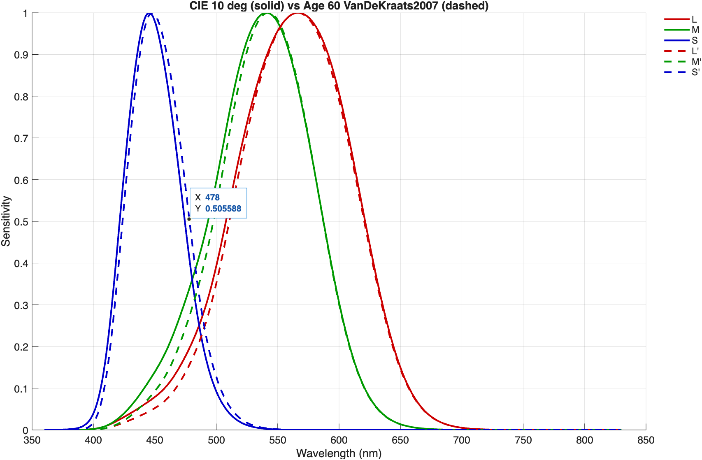

# Individual Cone Fundamentals Toolbox (MATLAB)

[](https://matlab.mathworks.com/open/github/v1?repo=sfu-cs-vision-lab/individual-cmfs-matlab)
[](.github/workflows/main.yml)
[](https://github.com/sfu-cs-vision-lab/individual-cmfs-matlab/actions/workflows/main.yml)
[](reports/badge/coverage.json)
[](reports/badge/code_issues.json)
[](https://cla-assistant.io/sfu-cs-vision-lab/individual-cmfs-matlab)

A MATLAB toolbox for computing **individual cone fundamentals** (observer-specific LMS spectral sensitivities and the RGB color matching functions derived from them) from biophysical parameters: opsin genotype, age, retinal field size, lens / macular / photopigment optical densities. The default Stockman & Rider (2023) photopigment + lens templates reproduce the CIE 170-1:2006 physiological standard observers (2-deg and 10-deg). Alternative templates (Govardovskii et al. 2000 for photopigments; Pokorny, Smith & Lutze 1987 and van de Kraats & van Norren 2007 for the age-dependent lens) can be substituted independently to model observer populations the CIE/S&R defaults don't cover. Output matches the reference Python implementation (`pycone`) to machine precision across the parity test suite (28 configurations &times; 5 output formats).

<p align="center">
  
  <br>
  <em>CIE 10-deg cone fundamentals (solid) vs. an age-60 observer under the van de Kraats &amp; van Norren 2007 lens model (dashed). Each cone is peak-normalized, so age-related lens yellowing shows up as a narrowing of the short-wavelength shoulder of every cone -- visually clearest on L and M, since their peaks sit outside the lens-absorption band and are preserved by normalization. In absolute (un-normalized) units the S cone is in fact the most attenuated. Generated by the "Two-observer comparison" section of <code>examples/Example17_PublicationFigures.m</code>.</em>
</p>

## Framework

The toolbox builds an L/M/S spectral sensitivity model from biophysical inputs (opsin genotype, age, retinal field size, lens and macular optical densities, per-cone photopigment optical densities, and lambda-max shifts) by traversing a four-stage pipeline:

1. **Photopigment absorbance.** A template positioned at the cone's lambda-max.
2. **Self-screening.** Beer-Lambert conversion from absorbance to relative retinal absorptance: `(1 - 10^(-OD * absorbance)) / (1 - 10^(-OD))`.
3. **Pre-receptoral filtering.** Lens and macular pigment density attenuate the retinal sensitivity to give the corneal cone fundamental.
4. **Quantal-to-energy.** Multiplication by wavelength converts photon-counting sensitivity to energy units (S&R 2023 Eq. 8).

Each stage's model is swappable: photopigment template (Stockman & Rider 2023 or Govardovskii 2000), lens model (Stockman & Rider 2023, Pokorny 1987, or van de Kraats & van Norren 2007), and macular template. `OutputFormat` selects which stage to return (`absorbance`, `absorptance`, `quantal`, `energy`). Defaults reproduce the CIE 170 physiological standard observers; any input can be overridden individually to model a specific observer or to study the effect of one biophysical parameter.

## What this toolbox adds over pycone

[`pycone`](https://github.com/CVRL-IoO/Individual-CMFs) is the reference Python implementation of Stockman & Rider (2023). This toolbox matches it at machine precision on the configurations pycone supports (see [`tests/parity/README.md`](tests/parity/README.md)), and extends it as follows.

**Additional models**

- Govardovskii et al. (2000) photopigment template (A1 and A2) for sub-400 nm extrapolation and cross-species use.
- Pokorny, Smith & Lutze (1987) two-component age-dependent lens model.
- van de Kraats & van Norren (2007) five-component total-ocular-media lens model with field-size-aware Rayleigh-loss coefficient and UV coverage.

**Correctness improvements vs pycone**

- Continuous-peak normalization (default) finds the true sub-grid peak via `fminbnd`; pycone normalizes against the discrete sample maximum.
- Sub-grid wavelength precision: MATLAB's `(start:step:stop)'` is exact; pycone's `np.arange` accumulates ~1e-5 IEEE-754 drift at 0.1 nm steps.
- Correct `log10(absorptance)` output under `LogOutput=true`; pycone's `absorptancefromabsorbance` logs the wrong stage.
- Mean-template shift guard: warns and switches to the Serine variant when a shift is applied to the fixed Mean L template; pycone produces undefined output.

**Ergonomics**

- Custom-mode density protection: explicit `LensDensity` / `MacularDensity` / `Lod` / `Mod` / `Sod` assignments auto-engage `Custom` mode and survive subsequent `Age` / `FieldSize` / `LensModel` changes.
- Round-trippable parameter snapshots via `getParameters` / `setParameters`.
- Visualization: twelve plot and compare methods on `IndividualCMF` (`plotLMS`, `plotXYZ`, `plotRGBCMFs`, `plotChromaticity`, `plotAbsorbance`, `plotAbsorptance`, `plotQuantalEnergy`, `plotLens`, `plotMacular`, `plotDiagnostics`, `compareTo`, `plot`), backed by a richer `CMFPlotter` class for standalone figures.

See [`tests/parity/README.md`](tests/parity/README.md) for pycone source-line references on the correctness items.

## Requirements

- **MATLAB R2023b** or later (uses `dictionary`, `configureDictionary`, `arguments` blocks, and modern Name=Value syntax). Plain Text Live Script rendering of the examples requires R2025a or newer.
- **Toolbox dependencies:** none. The toolbox uses only core MATLAB functions.

## Install (beta)

The toolbox is distributed as a `.mltbx` Add-On while in beta (not yet on MATLAB Central). Download the latest `.mltbx` from the [GitHub Releases page](https://github.com/sfu-cs-vision-lab/individual-cmfs-matlab/releases) and either:

- **Double-click** the `.mltbx` file -- MATLAB's Add-On Explorer will install it.
- **Or from the MATLAB command window** (downloads and installs the latest release):
  ```matlab
  url = "https://github.com/sfu-cs-vision-lab/individual-cmfs-matlab/releases/latest/download/individual-cmfs-matlab.mltbx";
  matlab.addons.install(websave(tempname + ".mltbx", url));
  ```

The Add-On adds `toolbox/` to your MATLAB path on every session and registers the toolbox with the Add-On Manager (uninstall there if needed). Examples and tests are not included in the `.mltbx`; clone the repo if you need them.

To file beta-testing feedback, open an issue at the [GitHub Issues page](https://github.com/sfu-cs-vision-lab/individual-cmfs-matlab/issues).

## Quick Start

> **Tip.** Click [](https://matlab.mathworks.com/open/github/v1?repo=sfu-cs-vision-lab/individual-cmfs-matlab) at the top of this README to launch the project in MATLAB Online without cloning.

```bash
git clone https://github.com/sfu-cs-vision-lab/individual-cmfs-matlab.git
```

Open `individual-cmfs-matlab.prj` in MATLAB to register the project paths, then run the primary example:

```matlab
edit examples/Example01_GettingStarted.m
% Click Run, or press F5
```

### Note on Example Files

All 18 example files in `examples/` are authored as **Plain Text Live Scripts** (R2025a or newer): they render with rich formatting in the Live Editor while remaining standard executable `.m` scripts in older MATLAB releases. Open one in the Editor for the rich-text view, or read it directly as commented code.

## Usage

```matlab
% CIE 2006 10-degree standard observer (default)
obs = IndividualCMF();

% CIE 2006 2-degree standard observer
obs = IndividualCMF(StandardObserver=2);

% StandardObserver is also a settable property: snap back to standard
% after editing a custom observer
obs.Age = 50;                     % drifts out of standard
disp(obs.StandardObserver);       % 0
obs.StandardObserver = 2;         % snap back to 2-deg standard
disp(obs.StandardObserver);       % 2

% Custom observer: 60 years old, 4-degree field, van de Kraats & van Norren 2007 lens model
obs = IndividualCMF(Age=60, FieldSize=4, LensModel="VanDeKraats2007");

% Genotype-driven L-cone (Alanine at codon 180)
obs = IndividualCMF(Genotype=struct(L_180="Ala"));

% Govardovskii (2000) continuous photopigment template
obs = IndividualCMF(PhotopigmentModel="Govardovskii2000");

% Manual override engages Custom mode (preserved across Age/FieldSize edits)
obs.LensDensity = 1.2;
disp(obs.LensDensityAlgorithm);   % "Custom"

% Evaluate cone sensitivities and derived quantities.
% Case follows the color-science convention: tristimulus quantities
% (LMS, RGB, XYZ, V*) uppercase; chromaticity coordinates (lm, xy, ls)
% lowercase.
wl  = (380:1:780)';
LMS = obs.LMS(wl);             % L, M, S as Nx3
RGB = obs.RGB(wl);             % RGB CMFs at the configured Primaries
XYZ = obs.XYZ(wl);             % CIE XYZ (2-deg or 10-deg matrix by FieldSize)
V   = obs.Luminance(wl);       % V*(lambda) = y-bar row of LMS->XYZ
lm  = obs.lmChromaticity(wl);  % LMS-sum chromaticity
xy  = obs.xyChromaticity(wl);  % CIE xy from XYZ
ls  = obs.MacLeodBoynton(wl);  % MacLeod-Boynton (l_MB, s_MB)

% One-off query in a different output format without mutating obs
A = obs.LMS(wl, OutputFormat="absorptance");

% Compare two observers
obs.compareTo(IndividualCMF(Age=70), Title="Effect of aging");

% Plot wrappers (all accept Wavelength=, Title=, Parent= options;
% plotLMS/plotAbsorbance/plotAbsorptance also accept Cones= and Log=;
% plotXYZ accepts Channels=)
obs.plotLMS(Cones=["L" "M"]);            % L and M only, observer's OutputFormat
obs.plotXYZ(Channels="Y");                % Y (luminous-efficiency) channel only
obs.plotLMS(Log=true);                    % log10 y-axis

% Build an array of observers across one parameter axis
observers = IndividualCMF.across('Age', [25 50 75], ...
    LensModel="VanDeKraats2007", FieldSize=10);
densities = [observers.LensDensity];

% Pre-receptoral filter spectra (lens + macular OD vs wavelength)
lensOD    = obs.getLensDensitySpectrum(wl);
macularOD = obs.getMacularDensitySpectrum(wl);

% Round-trip: capture, edit, restore
params = obs.getParameters();
obs2 = IndividualCMF();
obs2.setParameters(params);

% Export to CSV
data = obs.evaluate(wl, Data="LMS", Format="table");
writetable(data, "cone_fundamentals.csv");
```

The full set of name-value options (genotype dictionary, hybrid opsin variants, per-stage algorithm choice, custom RGB primaries, normalization method, output format, log-output toggle) is documented in the `IndividualCMF` class docstring. The `examples/` folder demonstrates each option in context.

For a tour of how the toolbox is internally organized (class hierarchy, the four-stage LMS pipeline, design patterns, and how to add a new template or algorithm mode), see [`ARCHITECTURE.md`](ARCHITECTURE.md).

## Project Structure

```
individual-cmfs-matlab/
|-- toolbox/                                     Source classes (.mltbx-packageable)
|   |-- IndividualCMF.m                          Top-level observer (LMS/RGB/XYZ/Luminance/chromaticity, plot/compareTo)
|   |-- ObserverParameters.m                     Value-object snapshot of observer state (getParameters/setParameters)
|   |-- Genotype.m                               Opsin genotype parser + Stockman & Rider 2023 shift table
|   |-- PhotopigmentTemplate.m                   Abstract base for photopigment templates
|   |-- StockmanRiderPhotopigmentTemplate.m      Stockman & Rider (2023) photopigment template (default)
|   |-- GovardovskiiPhotopigmentTemplate.m       Govardovskii et al. (2000) A1/A2 photopigment template
|   |-- LensTemplate.m                           Abstract base for lens templates
|   |-- StockmanRiderLensTemplate.m              Stockman & Rider (2023) lens template (default)
|   |-- Pokorny1987LensTemplate.m                Pokorny, Smith & Lutze (1987) two-component lens model
|   |-- VanDeKraatsVanNorren2007LensTemplate.m   van de Kraats & van Norren (2007) five-component lens model
|   |-- MacularTemplate.m                        Abstract base for macular templates
|   |-- StockmanRider2023MacularTemplate.m       Stockman & Rider (2023) macular template
|   |-- PhotopigmentParameters.m                 Per-cone OD container with algorithm-mode state
|   |-- PreReceptoralFilter.m                    Lens + macular pre-receptoral filter state
|   |-- CIE170.m                                 CIE 170-1:2006 / 170-2:2015 leaf-level constants
|   |-- Nomograms.m                              Raw absorbance computations (Fourier series, alpha/beta bands)
|   |-- NormalizationCache.m                     Per-(cone, format) peak cache with invalidation hooks
|   |-- CMFPlotter.m                             Visualization layer used by IndividualCMF plot wrappers
|   |-- +pipeline/                               Pure-function compute stages (PhotopigmentStage, PreReceptoralStage, OutputStage)
|   |-- +enums/                                  Strategy / algorithm-mode enum types
|   `-- +validators/                             Reusable mustBe* validators
|-- tests/                                       Unit, integration, and parity tests (matlab.unittest)
|   |-- data/                                    CSV reference data (incl. cvrl/ Stockman-Sharpe tables)
|   `-- parity/                                  Pycone parity adapter (compare.m, configs.json, run_pycone.py)
|-- examples/                                    Plain-text Live Scripts Example01_GettingStarted.m ... Example18_ObserverMetamerism.m
|-- buildUtilities/                              Badge generators used by buildfile.m
|-- reports/badge/                               shields.io endpoint JSONs (committed)
|-- resources/project/                           MATLAB project metadata (multi-file format)
|-- buildfile.m                                  MATLAB buildtool tasks: clean, check, test
|-- individual-cmfs-matlab.prj                   MATLAB project file
|-- ARCHITECTURE.md                              Internals tour (layering, pipeline, design patterns, extension points)
|-- CITATION.cff                                 Citation metadata
|-- LICENSE                                      AGPL-3.0-or-later
`-- .github/workflows/main.yml                   CI: static analysis, test matrix, badge refresh
```

## Building and Testing

The project uses MATLAB's `buildtool`. From the repo root:

```matlab
buildtool                 % Default tasks: check + test
buildtool clean           % Remove generated reports
buildtool check           % Static analysis on toolbox/ via codeIssues
buildtool test            % Run tests, emit JUnit XML and Cobertura coverage to reports/
buildtool package         % Build a redistributable .mltbx into dist/ (depends on check + test).
                          % Version is read from VERSION and the toolbox UUID
                          % from resources/toolbox/identifier.txt.
```

CI runs the same buildfile across MATLAB R2023b, R2024b, R2025b, and R2026a on every push and pull request.

## Citation

If you use this toolbox in your research, please cite the toolbox and the original scientific paper:

```bibtex
@software{forsythe2025matlab,
  author       = {Forsythe, Alexander and Funt, Brian},
  title        = {Matlab Individual Cone Fundamentals Toolbox},
  year         = {2025},
  institution  = {Simon Fraser University},
  url          = {https://github.com/sfu-cs-vision-lab/individual-cmfs-matlab}
}

@article{stockman2023formulae,
  author       = {Stockman, Andrew and Rider, Andrew T.},
  title        = {Formulae for generating standard and individual human cone spectral sensitivities},
  journal      = {Color Research and Application},
  volume       = {48},
  number       = {6},
  pages        = {818--840},
  year         = {2023},
  doi          = {10.1002/col.22879}
}
```

When you opt into a non-default lens, photopigment, or macular model, please also cite the underlying paper for that model. The full bibliography (Pokorny 1987 / van de Kraats & van Norren 2007 lens models, Govardovskii 2000 photopigment, Stockman & Sharpe 2000, Sharpe 2005, Stockman 2019, CIE 170, etc.) is in [`CITATION.cff`](CITATION.cff), which also serves GitHub's "Cite this repository" widget.

## License

AGPL-3.0-or-later (GNU Affero General Public License). See [LICENSE](LICENSE) for the full text.

## Copyright

Copyright (c) 2025-2026 Alexander Forsythe and Brian Funt. Simon Fraser University, Burnaby, British Columbia, Canada.
